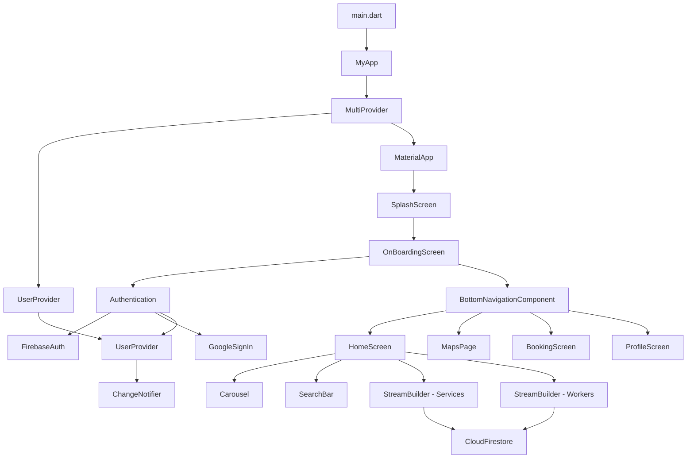
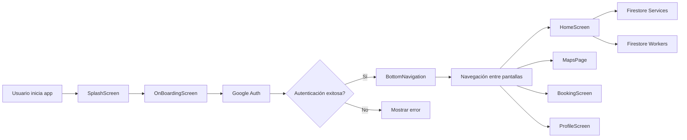

# Arquitectura de la Aplicación Salon Booking

## Diagrama de Componentes



## Diagrama de Flujo de Datos



## Estructura de Directorios

```
lib/
├── main.dart
├── components/
│   ├── bottom_navigationbar.dart
│   ├── carousel.dart
│   ├── searchbar.dart
│   └── date_picker.dart
├── controller/
│   └── auth_controller.dart
├── provider/
│   └── user_provider.dart
├── screens/
│   ├── booking/
│   │   └── booking_screen.dart
│   ├── home/
│   │   └── home_screen.dart
│   ├── introduction/
│   │   ├── onboarding_screen.dart
│   │   └── spalsh_screen.dart
│   ├── maps/
│   │   └── maps_screen.dart
│   └── profile/
│       └── profile_screen.dart
└── widgets/
    └── horizontal_line.dart