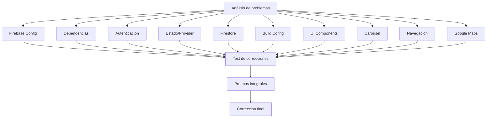

# Plan Detallado de Corrección para la Aplicación Salon Booking

## 1. Corregir errores de configuración de Firebase

### Problema identificado:
- Falta el archivo `google-services.json` en `android/app/src/main/`
- Configuración incompleta en `build.gradle`

### Solución propuesta:
1. Obtener el archivo `google-services.json` desde la consola de Firebase
2. Colocar el archivo en `android/app/src/main/`
3. Verificar la configuración en `android/app/build.gradle`:
   - Plugin `com.google.gms.google-services` aplicado
   - Dependencias de Firebase correctamente configuradas

### Archivos a modificar:
- `android/app/build.gradle`
- (Agregar) `android/app/src/main/google-services.json`

## 2. Actualizar dependencias en pubspec.yaml

### Problema identificado:
- Versiones de dependencias no especificadas
- Posibles incompatibilidades

### Solución propuesta:
1. Especificar versiones compatibles para todas las dependencias
2. Actualizar a versiones estables y compatibles

### Archivos a modificar:
- `pubspec.yaml`

## 3. Corregir errores en la implementación de autenticación

### Problema identificado:
- Manejo de errores insuficiente
- Implementación incompleta

### Solución propuesta:
1. Mejorar el manejo de errores en `Authentication.signInWithGoogle`
2. Agregar manejo de casos límite
3. Implementar cierre de sesión correctamente

### Archivos a modificar:
- `lib/controller/auth_controller.dart`

## 4. Revisar y corregir errores en el manejo de estado con Provider

### Problema identificado:
- Implementación básica que puede necesitar mejoras

### Solución propuesta:
1. Verificar la inicialización correcta del Provider
2. Asegurar notificaciones adecuadas de cambios de estado
3. Agregar validaciones

### Archivos a modificar:
- `lib/provider/user_provider.dart`
- `lib/main.dart`

## 5. Verificar y corregir errores en la conexión con Cloud Firestore

### Problema identificado:
- Consultas a Firestore sin manejo adecuado de errores
- Posible falta de inicialización

### Solución propuesta:
1. Verificar la inicialización de Firebase en `main.dart`
2. Agregar manejo de errores en las consultas a Firestore
3. Implementar fallbacks cuando no haya datos

### Archivos a modificar:
- `lib/main.dart`
- `lib/screens/home/home_screen.dart`

## 6. Corregir problemas de compatibilidad de versiones en build.gradle

### Problema identificado:
- Versiones de SDK y target posiblemente desactualizadas
- Configuración incompleta

### Solución propuesta:
1. Actualizar `compileSdkVersion` a la versión recomendada
2. Verificar `minSdkVersion` y `targetSdkVersion`
3. Asegurar compatibilidad con las dependencias de Firebase

### Archivos a modificar:
- `android/app/build.gradle`
- `android/build.gradle`

## 7. Revisar y corregir errores en los componentes de UI

### Problema identificado:
- Posibles errores de renderizado
- Problemas de layout en diferentes tamaños de pantalla

### Solución propuesta:
1. Verificar el uso correcto de widgets responsivos
2. Corregir problemas de overflow o layout incorrecto
3. Asegurar consistencia en el diseño

### Archivos a modificar:
- `lib/screens/home/home_screen.dart`
- `lib/components/searchbar.dart`
- `lib/components/bottom_navigationbar.dart`

## 8. Verificar la implementación correcta del carousel

### Problema identificado:
- Posibles problemas de configuración
- Imágenes que podrían no cargar correctamente

### Solución propuesta:
1. Verificar la configuración de `CarouselSlider`
2. Agregar manejo de errores para carga de imágenes
3. Asegurar funcionamiento correcto en diferentes dispositivos

### Archivos a modificar:
- `lib/components/carousel.dart`

## 9. Corregir errores en la navegación entre pantallas

### Problema identificado:
- Posibles problemas en la navegación entre pantallas
- Estados no manejados correctamente al navegar

### Solución propuesta:
1. Verificar la implementación de `BottomNavigationComponent`
2. Asegurar que el estado se maneje correctamente al cambiar de pantalla
3. Corregir posibles memory leaks

### Archivos a modificar:
- `lib/components/bottom_navigationbar.dart`
- `lib/screens/introduction/onboarding_screen.dart`

## 10. Revisar y corregir errores en la integración de Google Maps

### Problema identificado:
- Configuración incompleta de Google Maps
- Posibles problemas de permisos

### Solución propuesta:
1. Verificar la configuración de API keys
2. Asegurar permisos correctos en AndroidManifest.xml
3. Implementar manejo de errores en la integración de mapas

### Archivos a modificar:
- `lib/screens/maps/maps_screen.dart`
- `android/app/src/main/AndroidManifest.xml`
- (Agregar) Archivo de configuración de API keys

## Diagrama de Implementación

## Prioridad de Correcciones

1. **Alta prioridad** (bloqueantes):
   - Configuración de Firebase
   - Dependencias
   - Autenticación

2. **Media prioridad**:
   - Manejo de estado
   - Conexión Firestore
   - Build configuration

3. **Baja prioridad** (mejoras):
   - UI Components
   - Carousel
   - Navegación
   - Google Maps